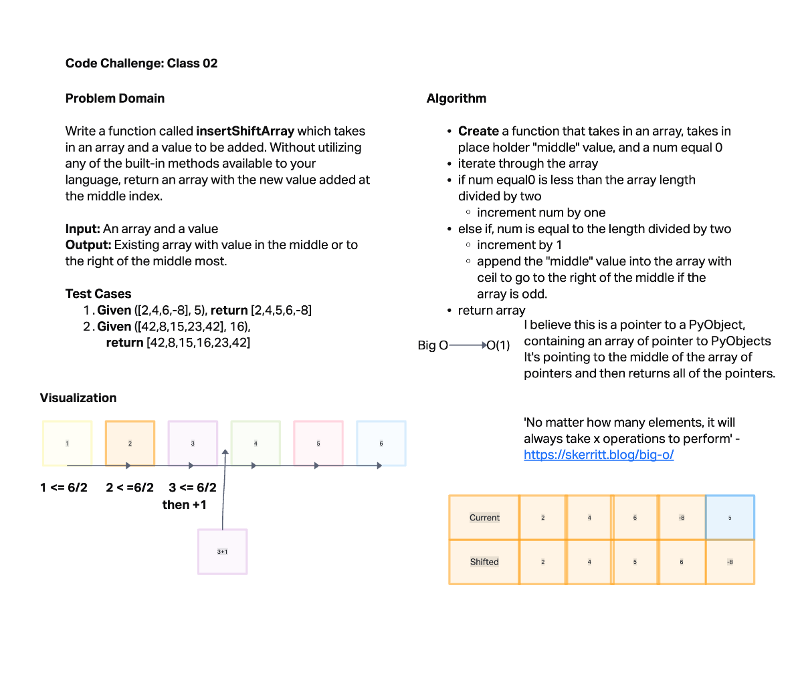

# Insert to Middle of an Array
<!-- Description of the challenge -->

Write a function called `insertShiftArray` which take in an array and a value to be added. Without utilizing any of the built-in methods available to your language, return an array with the new value added at the middle index.

## Whiteboard Process

## Approach & Efficiency
<!-- What approach did you take? Discuss Why. What is the Big O space/time for this approach? -->

Finding the length of the array and dividing it in half seemed to be the most logical to me. Once that got fleshed out, then finding how to insert it by adding 1 was easy. I didn't know how to do it without a rounding function, but a ceil function would work. I suppose that's a same built in method, but coming up with a formula without that method was out of my grasp at the moment. I'll probably dream something up tonight.

I believe this is a pointer to a PyObject, containing an array of pointer to PyObjects

It's pointing to the middle of the array of pointers and then returns all of the pointers.

'No matter how many elements, it will always take x operations to perform' - [https://skerritt.blog/big-o/](https://skerritt.blog/big-o/)
