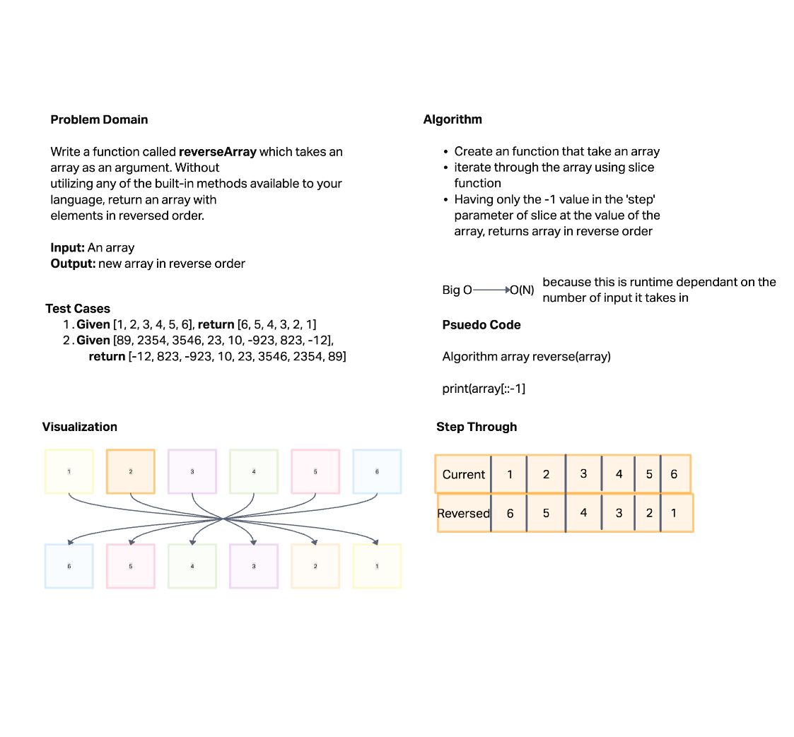

# Reverse an Array
<!-- Description of the challenge -->
Write a function called reverseArray which takes an array as an argument. Without utilizing any of the built-in methods available to your language, return an array with elements in reversed order.

## Whiteboard Process
<!-- Embedded whiteboard image -->

## Approach & Efficiency
<!-- What approach did you take? Discuss Why. What is the Big O space/time for this approach? -->

Slice made the most sense to me when this challenge got brought up. I can instantly visualize what slice does when taking in a list. By using the step parameter of slice and leaving the start and end empty, it takes the last part of an array and prints it immediately, and continues to do that till there is no data left.

I **believe** The Big O here is time, it doesn't increment in quantity, but it has to read through the array to find the last item to print.
