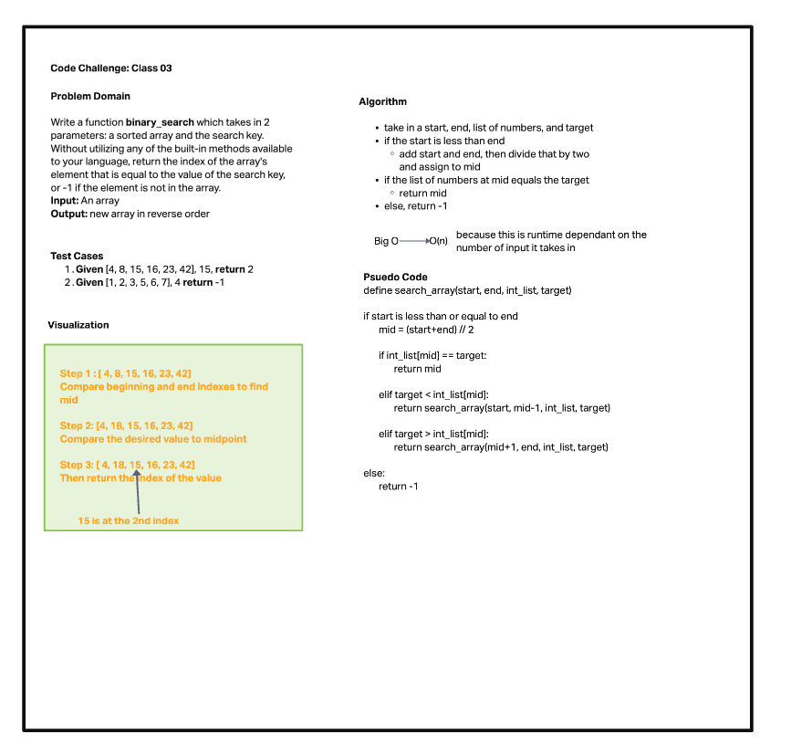

# Binary Search of Sorted Array
<!-- Description of the challenge -->
Write a function binary_search which takes in 2 parameters: a sorted array and the search key. Without utilizing any of the built-in methods available to your language, return the index of the array's element that is equal to the value of the search key, or -1 if the element is not in the array.

## Whiteboard Process
<!-- Embedded whiteboard image -->

## Approach & Efficiency
<!-- What approach did you take? Discuss Why. What is the Big O space/time for this approach? -->

I started right the function out first, and then hopped back into fleshing out the white board.
once I completed the visualization and algorithm, I started after the code till it worked. Once I got the code working I tweaked the algorithm and finished the psuedocode.
