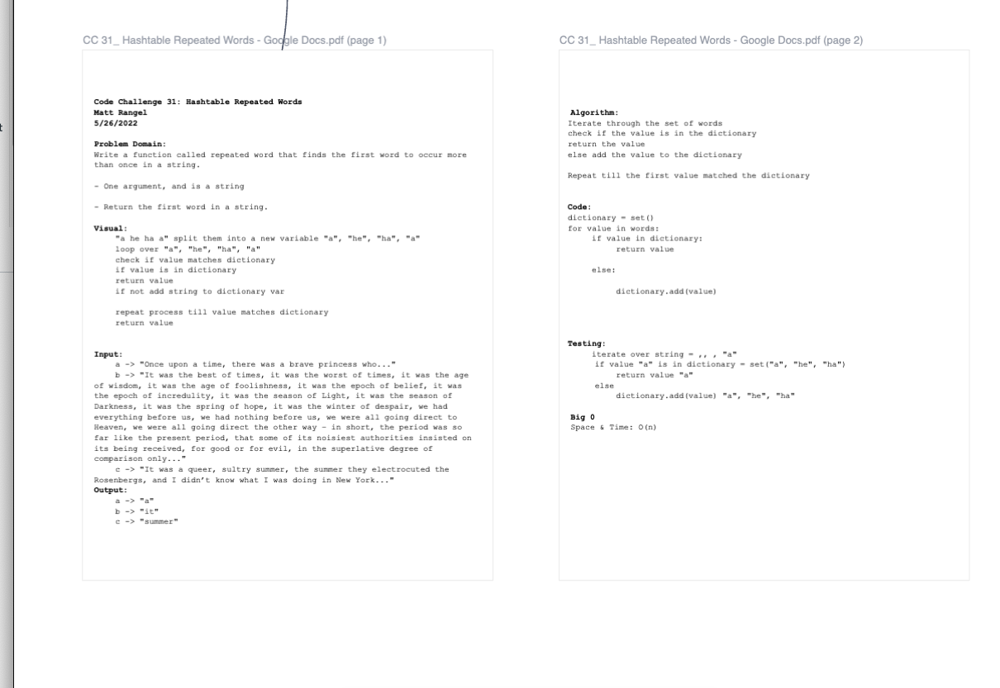

# Hashtable Repeated Words
<!-- Short summary or background information -->
Write a function called repeated word that finds the first word to occur more than once in a string.

- One argument, and is a string

- Return the first word in a string.

## Challenge
<!-- Description of the challenge -->
Code Challenge/Algorithm

## Whiteboard Process

## Approach & Efficiency
<!-- What approach did you take? Why? What is the Big O space/time for this approach? -->

Big O:

O(N) operation, because it takes that many steps for how many strings to find that first repeated string.

## Unit Tests
<!-- Description of each method publicly available to your Linked List -->

Wrote a tests that:

- Tests if stack exists
- Test if enqueue value is dequeued
- Test if two enqueued values have been dequeued
- Test if you can enqueue to dequeue, from enqueue to dequeue.

## Links and Resources

- [set add()in python](https://www.geeksforgeeks.org/set-add-python/)
- [Stack Overflow: Regex](https://stackoverflow.com/questions/12985456/replace-all-non-alphanumeric-characters-in-a-string)
- Justin "The Hammer" Hamerly
- Bishal Khanal
- Roger Wells
- Nicholas Mercado
