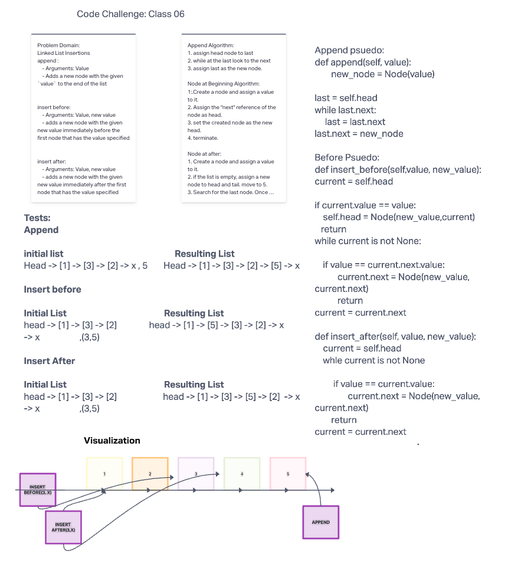

# Linked List Insertions
<!-- Short summary or background information -->
Write the following methods for the linked list class:

append :
    - Arguments: Value
    - Adds a new node with the given `value` to the end of the list

insert before:
    - Arguments: Value, new value
    - adds a new node with the given new value immediately before the first node that has the value specified

insert after:
    - Arguments: Value, new value
    - adds a new node with the given new value immediately after the first node that has the value specified

## Challenge
<!-- Description of the challenge -->
Extending an Implementation

## Whiteboard Process

## Approach & Efficiency
<!-- What approach did you take? Why? What is the Big O space/time for this approach? -->

O(1), because it is insertion, BUT getting to the middle of node is O(n)

## API
<!-- Description of each method publicly available to your Linked List -->

## Links and Resources

- [python wife](https://pythonwife.com/linked-lists-in-python/)
- [real python](https://realpython.com/linked-lists-python/#how-to-insert-a-new-node)
- [tutorialspoint](https://www.tutorialspoint.com/python-exception-base-classes)
