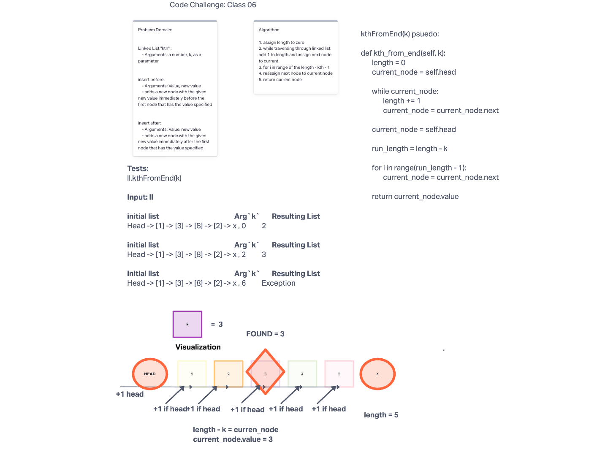

# Linked List kth
<!-- Short summary or background information -->
Write the following methods for the linked list class:

kth from end:
    - Arguments: Va number, `k`, as a parameter.
    - Return the node's value that is `k` places from the tail of the linked list.
    - You have access to the Node class and all the properties on the Linked List class ass well as the methods created in previous challenges.

## Challenge
<!-- Description of the challenge -->
Extending an Implementation

## Whiteboard Process

## Approach & Efficiency
<!-- What approach did you take? Why? What is the Big O space/time for this approach? -->

Main approach to this is O(n) because finding the kth node from beginning to end takes time, O(1), because it is extracting a value

## API
<!-- Description of each method publicly available to your Linked List -->

## Links and Resources

- David Hecker
- Morning Lecture
