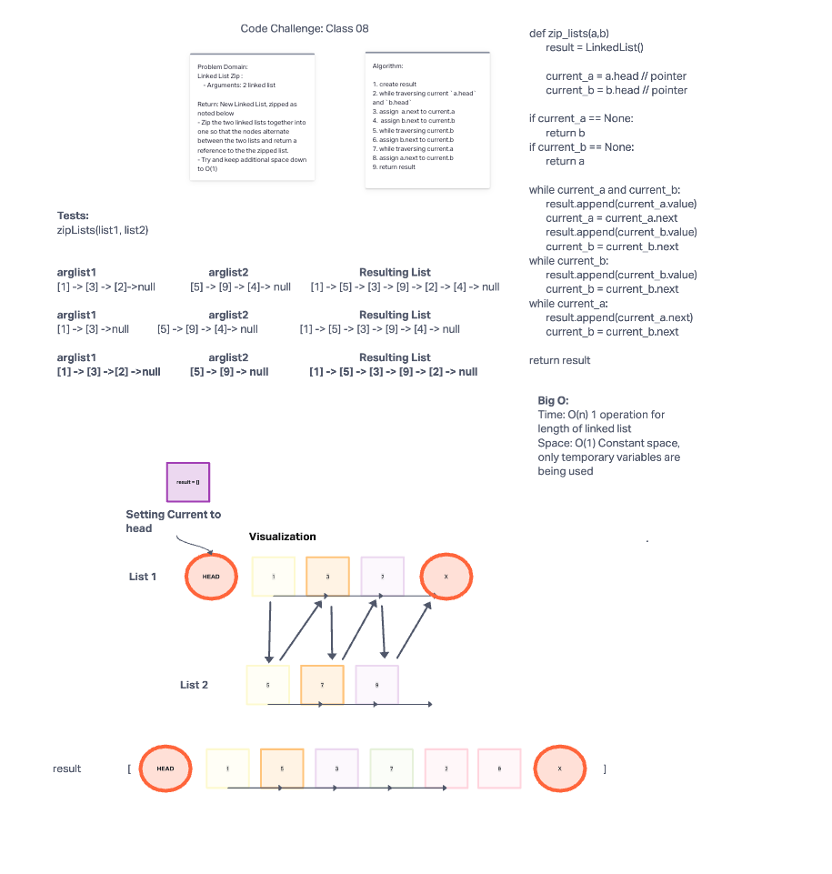

# Linked List Zip
<!-- Short summary or background information -->
Create a function called zip lists

Arguments:
    - 2 linked lists

Return:
    - New Linked List, zipped as noted below
    - Zip the two linked lists together into one so that the nodes alternate between the two lists and return a reference to the zipped list.
    - Try and keep additional space down to O(1)
    - You have access to the Node class and all the properties on the Linked List class as well as the methods created in previous challenges.

## Challenge
<!-- Description of the challenge -->
Code Challenge / Algorithm

## Whiteboard Process

## Approach & Efficiency
<!-- What approach did you take? Why? What is the Big O space/time for this approach? -->

We are taking two lists, a and b and starting at a.head and insert b.head after that.
Set a.head to a.next, and a.next will be on the newly inserted b.
Set the b.head to b.next so you can get the new value from the b list.
When there is an a.next then advance one more so that you are off the newly added B and back on the next node of the A-list.

Big O:

Time: O(n) 1 operation for length of linked list

Space: O(1) Constant space, only temporary variables are being used

## Unit Tests
<!-- Description of each method publicly available to your Linked List -->

Wrote a tests that:

- Tests if linked lists are even.
- Test if a link list is shorter than b.
  - And conversely b to a.
- Tests if a linked list is empty.
  - And conversely if b linked lists is empty.

## Links and Resources

- David Hecker
- Dwight Lindquist
- Morning Lecture
