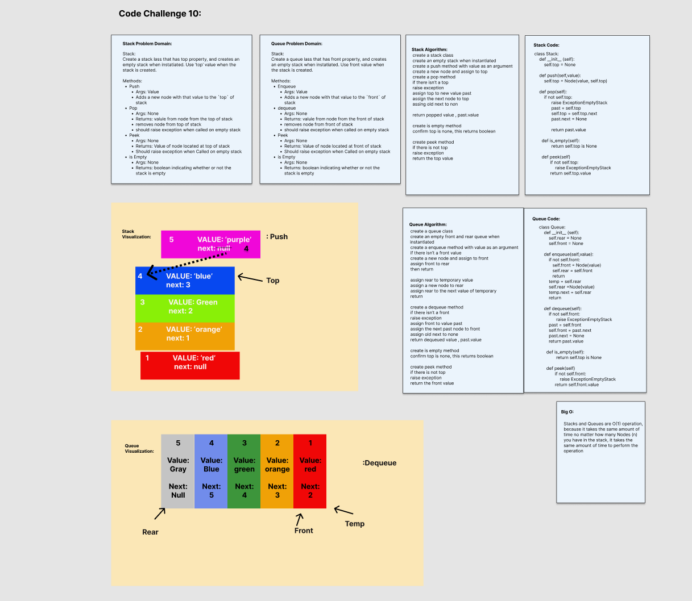

# Linked List Stack and Queue
<!-- Short summary or background information -->
Using a Linked List as the underlying data storage mechanism, implement both a **Stack** and a **Queue**

## Node

- Create a Node class that has properties for the values stored in the Node, and a pointer to the next node

## Stack

- Create a Stack class that as a top property. It creates an empty Stack when instantiated.
  - This object should be aware of a default empty value assigned to `top` when the stack is created.
  - The class should contain the following methods:
  - push
    - Arguments: Value
    - adds a new node with that value to the `top` of the stack with an O(1) Time performance.
  - pop
    - Arguments: none
    - Returns: the value from node from the top of the stack
    - Removes the node from the top of the stack
    - Should raise exception when called on empty stack
  - peek
    - Arguments: none
    - Returns: Value of the node located at the top of the stack
    - Should raise exception when called on empty stack
  - is empty
    - Arguments: none
    - Returns: Boolean indicating whether or note the stack is empty

## Queue

- Create a Queue class that as a front property. It creates an empty queue when instantiated.
  - This object should be aware of a default empty value assigned to `front` when the queue is created.
  - The class should contain the following methods:
  - enqueue
    - Arguments: Value
    - adds a new node with that value to the `back` of the queue with an O(1) Time performance.
  - dequeue
    - Arguments: none
    - Returns: the value from node from the front of the queue
    - Removes the node from the front of the queue
    - Should raise exception when called on empty queue
  - peek
    - Arguments: none
    - Returns: Value of the node located at the front of the queue
    - Should raise exception when called on empty queue
  - is empty
    - Arguments: none
    - Returns: Boolean indicating whether or note the queue is empty

## Challenge
<!-- Description of the challenge -->
New Implementation

## Whiteboard Process

## Approach & Efficiency
<!-- What approach did you take? Why? What is the Big O space/time for this approach? -->

Big O:

Stacks and Queues are O(1) operation, because it takes the same amount of time no matter how many Nodes (n) you have in the stack, it takes the same amount of time to perform the operation

## Unit Tests
<!-- Description of each method publicly available to your Linked List -->

### Stack Unit Tests

Wrote a tests that:

- Tests if stack exists
- Test if push onto empty
- Test if push onto full
- Test if pop a single and pop some
- Test if pop will occur until empty
- Test if peek at the top value
- Test if peek is empty
- Test the pop empty

### Queue Unit Tests

Wrote a tests that:

- Tests if queue exists
- Test if enqueue as front value onto empty
- Test if dequeue works
- Test if peek at the top value
- Test if peek is empty
- Test if enqueue one value works
  - Test enqueue two values
- Test if dequeue value is empty
- Test if dequeue works when full
- Test if empty

## Links and Resources

- David Hecker
- Dwight Lindquist
- Roger Wells
- Bishal Khanal
- Afternoon Lecture
