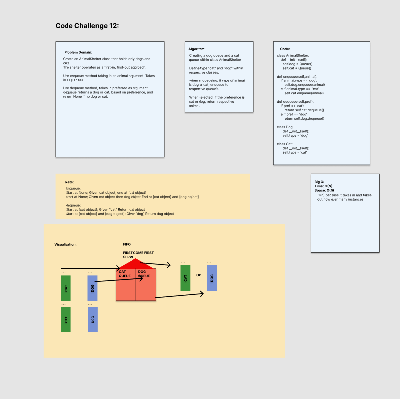

# Stack Queue Animal Shelter
<!-- Short summary or background information -->
Create an AnimalShelter class that holds only dogs and cats.
The shelter operates as a first-in, first-out approach.

Use enqueue method taking in an animal argument. Takes in dog or cat

Use dequeue method, takes in preferred as argument.
dequeue returns a dog or cat, based on preference, and return None if no dog or cat.

## Challenge
<!-- Description of the challenge -->
Code Challenge/Algorithm

## Whiteboard Process

## Approach & Efficiency
<!-- What approach did you take? Why? What is the Big O space/time for this approach? -->

Big O:

O(N) operation, because it takes that many steps for how many animals added and removed

## Unit Tests
<!-- Description of each method publicly available to your Linked List -->

### Stack Unit Tests

Wrote a tests that:

- Tests if type of cat is enqueue, dequeue cat
- Tests if type of dog is enqueue, dequeue dog
- Tests if type of dog is preferred, but cat in front of queue, dog is still returned
- Test if dog enqueue and cat enqueued, then return dog dequeue then return cat dequeue
- Test if animal not in shelter returns `None`

## Links and Resources

- Adam Owada
- Justin Hamerly
- Roger Wells
- Bishal Khanal
- Morning Lecture
