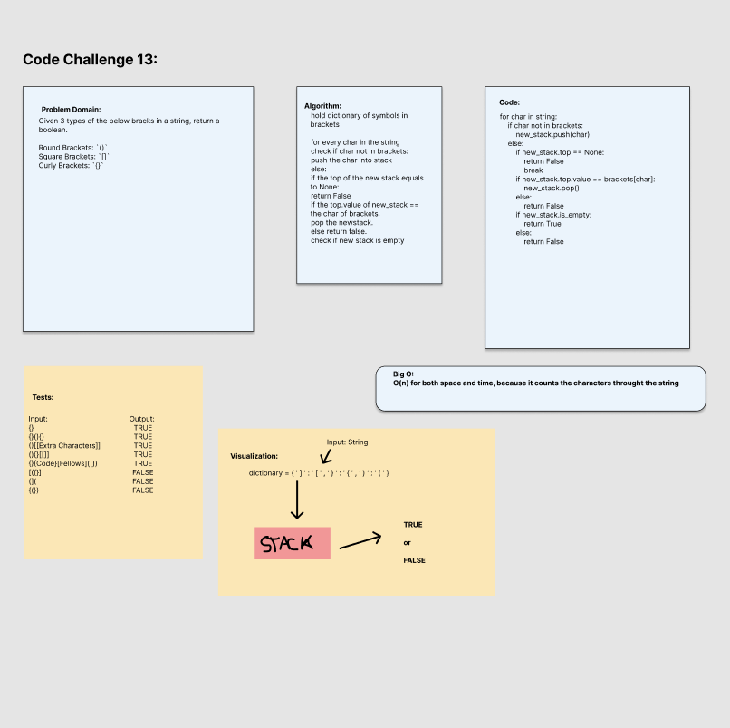

# Stack Queue Brackets
<!-- Short summary or background information -->
Given 3 types of the below brackets in a string, return a boolean.

Round Brackets: `()`
Square Brackets: `[]`
Curly Brackets: `{}`

## Challenge
<!-- Description of the challenge -->
Code Challenge/Algorithm

## Whiteboard Process

## Approach & Efficiency
<!-- What approach did you take? Why? What is the Big O space/time for this approach? -->

I tested the first test to get an easy pass. Then knew that I wanted to look at each character within the string. I pushed that character into a new stack and then compared the value to a dictionary of brackets. If matched then loop again. Run through the loops til the all characters are popped, else return false.

At the end, return if stack is empty or not.

Big O:
O(n) for both space and time, because it counts the characters through the string
<!-- O(N) operation, because it takes that many steps for how many animals added and removed -->

## Unit Tests
<!-- Description of each method publicly available to your Linked List -->

Wrote a tests that:

- Tests if opening and closing brackets/braces/parenthesis match
- Tests if flipped brackets/braces/parenthesis match
- Tests if multiple brackets match
- Tests if multiple nested brackets match
- Test if mixed matches don't match
- Test if nested mixed matches don't match

## Links and Resources

- Morning Lecture
- Adam Owada
- Justin Hamerly
- Ella Svet
- James Brooks
- Roger Wells
- Bishal Khanal
- Dwight Landquist
