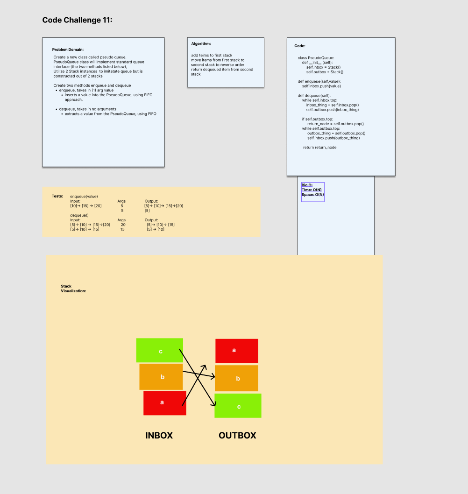

# Stack Queue Pseudo
<!-- Short summary or background information -->
Create a new class called pseudo queue.
PseudoQueue class will implement standard queue interface (the two methods listed below),
Utilize 2 Stack instances  to imitatate queue but is constructed out of 2 stacks

Create two methods enqueue and dequeue
enqueue, takes in (1) arg value
inserts a value into the PseudoQueue, using FIFO approach.

dequeue, takes in no arguments
extracts a value from the PseudoQueue, using FIFO

## Challenge
<!-- Description of the challenge -->
Code Challenge/Algorithm

## Whiteboard Process

## Approach & Efficiency
<!-- What approach did you take? Why? What is the Big O space/time for this approach? -->

Big O:

O(N) operation, because it takes that many steps for how many nodes it needs to loop through, and we are going through two stacks, so that is another O(N)

## Unit Tests
<!-- Description of each method publicly available to your Linked List -->

### Stack Unit Tests

Wrote a tests that:

- Tests if stack exists
- Test if enqueue value is dequeued
- Test if two enqueued values have been dequeued
- Test if you can enqueue to dequeue, from enqueue to dequeue.

## Links and Resources

- Adam Owada
- Ben Carter
- Roger Wells
- Bishal Khanal
- Morning/Afternoon Lecture
