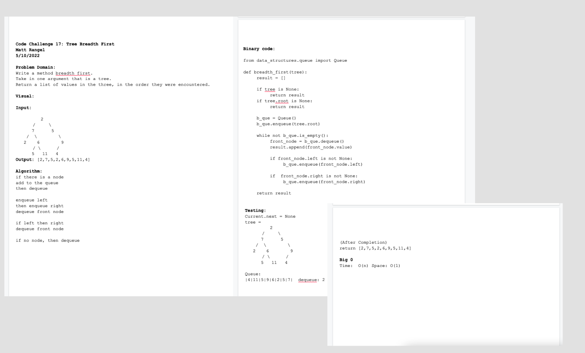

# Tree Breadth First
<!-- Short summary or background information -->
Write a method breadth first.
Take in one argument that is a tree.
Return a list of values in the three, in the order they were encountered.

## Challenge
<!-- Description of the challenge -->
Code Challenge / Algorithm

## White Board Process

## Approach & Efficiency
<!-- What approach did you take? Why? What is the Big O space/time for this approach? -->

Big O:

Time: Trees are O(n) operation, for for taking in a tree and enqueuing/dequeuing then appending it to an array. This is because the tree has `n` nodes, then in the worst case we will have to look at `n` times.

Space: is O(1) nothing is being added, just storing the value already in the tree, while searching.

## Unit Tests
<!-- Description of each method publicly available to your Linked List -->
Wrote a tests that:

- Tests if breadth function exists
- Test if breadth tree exists
- Test if root node in breadth can be added
- Test if right child in breadth can be added
- Test if 4 nodes of combination left/right
- Test if 4 nodes of combination left/right

## Links and Resources

- [Trees](https://codefellows.github.io/common_curriculum/data_structures_and_algorithms/Code_401/class-15/resources/Trees.html)
- Dwight Lindquist
