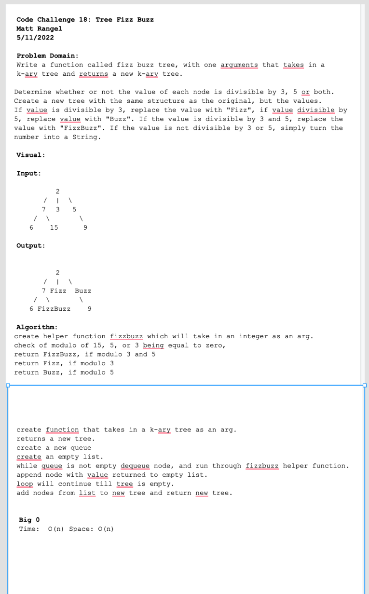

# Tree Fizz Buzz
<!-- Short summary or background information -->

Write a function called fizz buzz tree, with one arguments that takes in a k-ary tree and returns a new k-ary tree.

Determine whether or not the value of each node is divisible by 3, 5 or both. Create a new tree with the same structure as the original, but the values.
If value is divisible by 3, replace the value with "Fizz", if value divisible by 5, replace value with "Buzz". If the value is divisible by 3 and 5, replace the value with "FizzBuzz". If the value is not divisible by 3 or 5, simply turn the number into a String.

## Challenge
<!-- Description of the challenge -->
Code Challenge / Algorithm

## White Board Process

## Approach & Efficiency
<!-- What approach did you take? Why? What is the Big O space/time for this approach? -->

Big O:

Time: Trees are O(n) operation, for for taking in a tree and enqueuing/dequeuing then appending it to an array. This is because the tree has `n` nodes, then in the worst case we will have to look at `n` times.

Space: is O(1) nothing is being added, just storing the value already in the tree, while searching.

## Unit Tests
<!-- Description of each method publicly available to your Linked List -->
No tests were written, as JB said all we needed to do was the whiteboard.

## Links and Resources

- [Trees](https://codefellows.github.io/common_curriculum/data_structures_and_algorithms/Code_401/class-15/resources/Trees.html)
- Roger Wells
