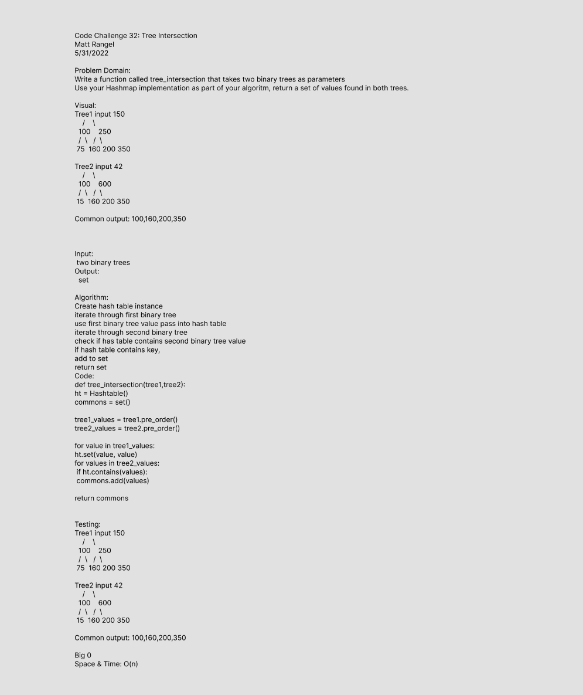

# Tree Intersection
<!-- Short summary or background information -->
- Write a function called `tree-intersection` that takes two binary trees as parameters.
- Using your Hashmap implementation as a part of your algorithm, return a set of values found in both trees.

## Challenge
<!-- Description of the challenge -->
Find common values in 2 binary trees

## Whiteboard Process

## Approach & Efficiency
<!-- What approach did you take? Why? What is the Big O space/time for this approach? -->

Big O:
Space and Time is O(n), because it's taking in n amount of trees and nodes and returning the compared.

## Unit Tests
<!-- Description of each method publicly available to your Linked List -->

Wrote a tests that:

- Tests if a function takes in two trees as parameters and added values, return the like for like numbers in a set.

## Links and Resources

- Bishal Khanal
- Roger Wells
- Nicholas Mercado
