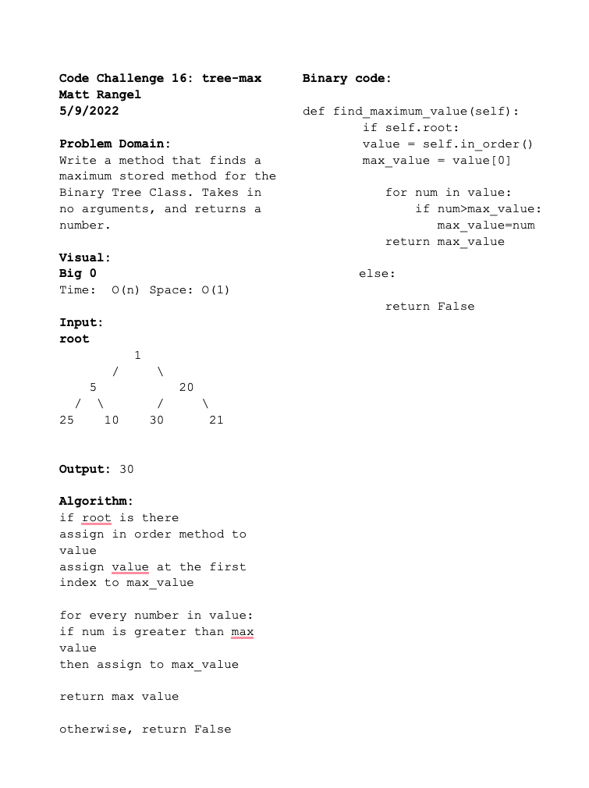

# Tree Max
<!-- Short summary or background information -->
Write a method that finds a maximum stored method for the Binary Tree Class. Takes in no arguments, and returns a number.

## Challenge
<!-- Description of the challenge -->
New Implementation

## White Board Process

## Approach & Efficiency
<!-- What approach did you take? Why? What is the Big O space/time for this approach? -->

Big O:

Time: Trees are O(n) operation, for storing and returning a max value. This is because the tree has `n` nodes, then in the worst case we will have to look at `n` times.

Space: is O(1) nothing is being added, just storing the value already in the tree, while searching.

## Unit Tests
<!-- Description of each method publicly available to your Linked List -->
Wrote a tests that:

- Tests if Node exists
- Test if Node is created, and if left and right node has `None`.
- Test if BinaryTree exists
- Test if tree returns a pre ordered/in order/post order traversal

### Binary Search Tree Unit Tests

Wrote a tests that:

- Tests what is max value within leaves of tree
- Test what max value within left/right child of tree
- Test if root has no value

## Links and Resources

- Bishal Khanal
- Trees documentation in CodeFellows Readings.
